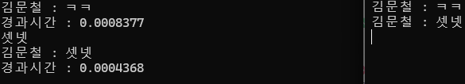

# project_hiocp
**WinSock 기반 IOCP 채팅서버**

---
## 서버 흐름도

---

## 프로젝트 개요

- WinSock 기반 IOCP 서버
- 비동기 Accept , 비동기 Send , Recv
- 멀티스레드 환경의 동시성 제어
- IOCP 구현에만 집중한 것이아닌, 서버 아키텍쳐 로서의 고민
- 서버 로직전용 큐 - 스레드풀 구조 도입
- I/O 작업 -> C API
- 서버로직 -> C++ RAII 기반으로 구현

---

## Directory

|폴더명|설명|
|:--:|:--:|
|구현중|구현중|

---

## API 문서 (ver 0.0.1)

> 구현중

---

## 향후 계획 (Roadmap)

- [x] IOCP 모델 구현 (WinSock) (250530)
- [x] 가독성을 위한 헬퍼 클래스 구현 (250601)
- [x] I/O Task , ServerLogic Task 철저히 분리 (각각 전용 스레드풀)
- [x] Session 등 원활한 서버 관리를 위한 클래스 설계
- [x] 테스트
- [x] 문서화

---

## 개발 일지

- 250530
    - [Velog포스팅](https://velog.io/@owljun/%EC%86%8C%EC%BC%93%ED%94%84%EB%A1%9C%EA%B7%B8%EB%9E%98%EB%B0%8D-WinSock-05.-%EB%B9%84%EB%8F%99%EA%B8%B0%EB%A1%9C-%ED%81%B4%EB%9D%BC%EC%9D%B4%EC%96%B8%ED%8A%B8-%EC%97%B0%EA%B2%B0%EC%9D%84-%EB%B0%9B%EC%9D%84%EB%95%8C-%EB%AC%B4%EC%8A%A8%EC%9D%BC%EC%9D%B4-%EC%9D%BC%EC%96%B4%EB%82%A0%EA%B9%8C-mswsock-AcceptEx)
    - IOCP 구조 , 비동기 Accept , Send , Recv 학습 후 처음 구현
    - 설계의 복잡성과 소켓과 컨텍스트 등 동적할당된 객체들의 생명주기 컨트롤에 대한 문제 인식
    - 처음 내린 결론 : 둘 다 한번에 해결할 수 있는 C++ RAII 개념을 들고와보자.

- 250601
    - 프레임워크, 라이브러리의 위대함이란.. 앞으론 감사히 쓰도록 하겠습니다.
    - 복잡한 네트워크 기본 작업 등 헬퍼클래스 구현 (WinSockManager)
    - 각 세션은 SessionManager 클래스가 생명주기를 관리.
    - 역할 분담
        - 네트워크I/O -> Server클래스
        - I/O -> Parsing(Accept,Recv,Send) -> 핸들러 실행
        - 각 Session 클래스에서 FSM 기반 분기 -> TLP기반 경계 수신
    - 오늘은 여기 까지 구현.

    - 다음회차
        - 로직워커에서 작업패킷 받아서 처리 & 가공
        - Session의 송신 큐에 삽입 (1:1 통신시)
        - 브로드캐스팅 : SessionManager 클래스에서 모든 Session의 송신 큐에 삽입
        - 송신큐 작업있으면 자동으로 Send 예약 (모니터패턴 구현)
        - 간단한 채팅클라 제작 후 테스트할 것.

- 250602
    - 기본 구조 및 채팅서버 기능 완성
    - 간단한 경과시간 테스트
        - 1. 클라이언트는 자신의 메시지를 send 한 시점을 기록 recv 한 시점에서 send시점의 시간을 뺀다.
        - 2. 서버는 부하테스트, 모든 메시지를 브로드캐스팅하는데 걸리는 시간을 잰다.
    - 결과
        - 2명 접속, 클라이언트 단위 : **second (a 결과)**
            
        - 2명 접속, 서버 단위 : **second (b 결과)**
            

        - 5002명 접속 , 클라이언트 단위 : **second (a 결과)**
            
        - 5002명 접속 , 서버 단위 : **second (b 결과)**
            
    - 후기
        - 물론 지금 서버가 처리하는 로직이 아주 간단한 패킷 파싱 -> 채팅 메시지 브로드캐스팅 뿐이긴 하지만
        5000명이 넘게 들어와도 처리하는데 약2.3초밖에 안걸렸다는게 초심자인 나에게 뭔가 뿌듯함을 주었다.
        - 머리 깨져가며 디버깅하고, 스트레스 받았던 고통이 싹 내려갔다. 말로만 고성능 고성능 해서 성능 좋은 서버인줄은 알았지만, 실제로 내가만든 녀석이 좋은 성능을 보이니 이건 잊을 수 없는 기억이다.